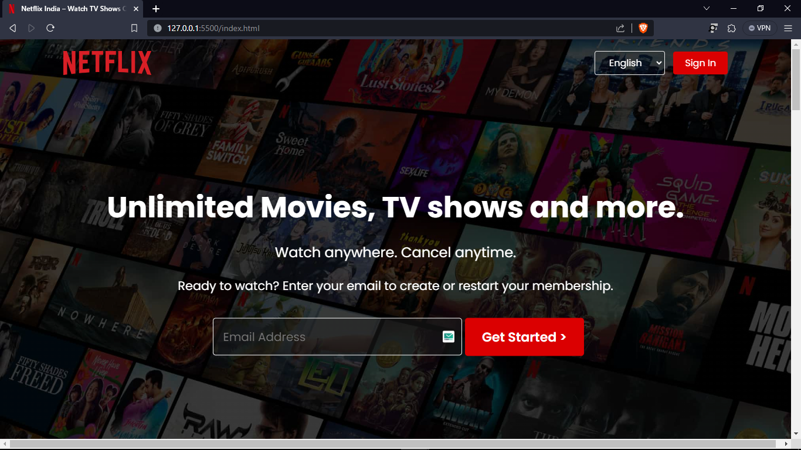

# Netflix-Homepage

This project is a clone of the Netflix homepage, created as part of a web development internship at Bharat Intern. The goal was to replicate the visual design and layout of the Netflix homepage using HTML and CSS, showcasing skills in web development.

## Authors

- [@Aakash-Rajbhar](https://www.github.com/aakash-rajbhar)

## Demo
https://aakash-rajbhar.github.io/Netflix-Homepage/

## Screenshots



## Features

- Header: The header section includes the Netflix logo, navigation elements, and a language selector.

- Main Content: The main content features a prominent header text, a subscription form, and sections highlighting key features.
- Feature Sections: Various sections highlight key features of the Netflix platform, including TV show streaming, offline downloads, multi-device support, and kid-friendly profiles.
- FAQ Section: A Frequently Asked Questions section provides information about Netflix, subscription costs, device compatibility, cancellation, content library, and kid-friendly options.
- Footer: The footer includes links to frequently accessed pages, contact information, language selection, and copyright information.

## Tools Used

- HTML5
- CSS3
- Google Fonts (Poppins)
- Images & Video from Netflix official website

  
## Getting Started

To view the Netflix homepage clone, follow these steps:

- 1 .Clone the repository

```bash
  git clone https://github.com/aakash-rajbhar/Netflix-Homepage.git

```
- 2 .Open the index.html file in your web browser.

  Feel free to suggest any changes and contribution for making this project even better, Thanx.

